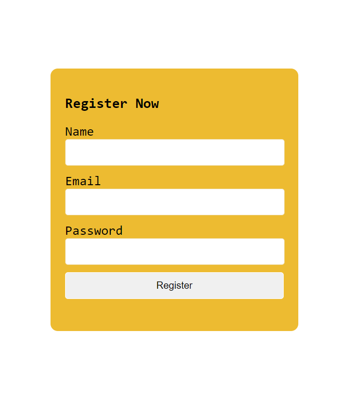

# Pass Data as a object using setState() method

## Method - 1

```jsx
import { useState } from "react";
function Myform() {
  const [name, setName] = useState("");
  const [email, setEmail] = useState("");
  const [password, setPassword] = useState("");

  const nameHandler = (data) => {
    setName(data.target.value);
  };
  const emailHandler = (data) => {
    setEmail(data.target.value);
  };
  const passwordHandler = (data) => {
    setPassword(data.target.value);
  };
  const submitHandler = (data) => {
    const UserInfo = {
      name,
      email,
      password,
    };
    data.preventDefault();
    console.log(UserInfo);
  };
  return (
    <div>
      <form className="formWrapper" onSubmit={submitHandler}>
        <h2>Register Now</h2>
        <div className="inputGroup">
          <label htmlFor="name">Name</label>
          <input
            type="text"
            id="name"
            value={name}
            onChange={nameHandler}
            required
          />
        </div>
        <div className="inputGroup">
          <label htmlFor="email">Email</label>
          <input
            type="email"
            id="email"
            value={email}
            onChange={emailHandler}
            required
          />
        </div>
        <div className="inputGroup">
          <label htmlFor="password">Password</label>
          <input
            type="password"
            id="password"
            value={password}
            onChange={passwordHandler}
            required
          />
        </div>
        <div className="inputGroup">
          <button type="submit" className="formBtn">
            Register
          </button>
        </div>
      </form>
    </div>
  );
}
export default Myform;
```

## Method - 2

```jsx
const [user, setUser] = useState({ name: "", email: "", password: "" });
const { name, email, password } = user;

const handleChange = (data) => {
  const fieldName = data.target.name;
  setUser({ ...user, [data.target.name]: data.target.value });
};
const submitHandler = (data) => {
  console.log(user);
  data.preventDefault();
};
```

## Form Design


